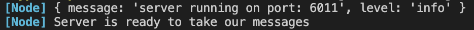
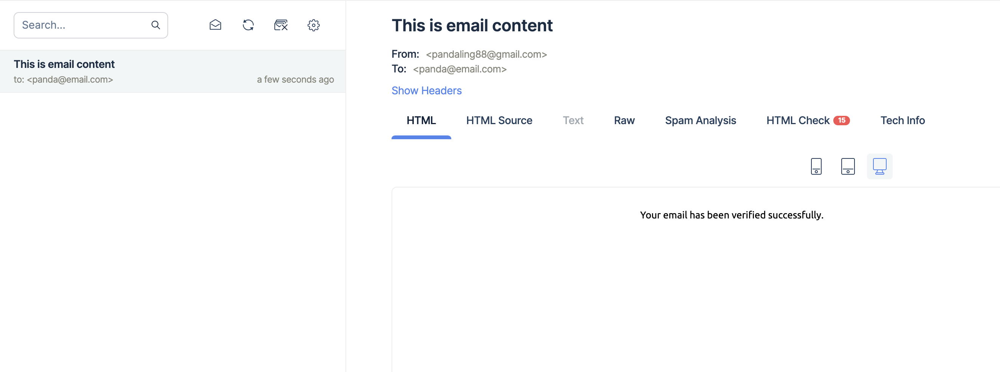
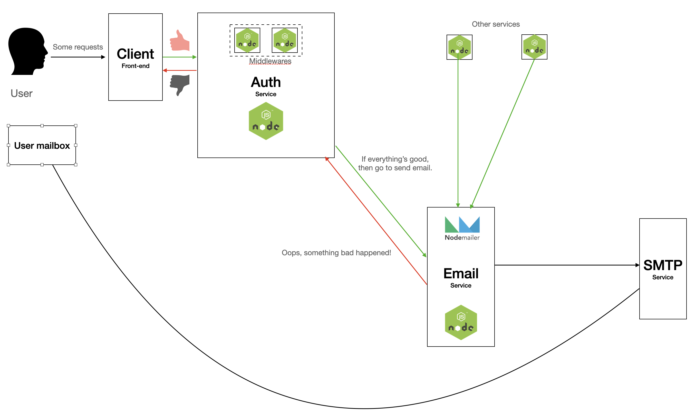

# Project
A microservice for sending email.

### Tech used
- nodejs - typescript
- nodemailer npm package
- mailtrap

### How to start
1. update the config file `.env.example` to use actual value.
2. rename `/env.example` to `.env`.
3. Install all the dependencies.
```shell
$ npm install
```
4. To start the program.
```shell
$ npm start
```
5. Upon successfully start the program, you should see below messages in the terminal


6. If good, then use the snippet below for testing. It should return response message `Success`.
```shell
curl --location --request POST 'localhost:6011/v1/test/my/register/verify' \
--header 'Content-Type: application/json' \
--header 'Cookie: _auth_verification=%7B%22nonce%22%3A%22mdtZwdfYO9DCCPngN5xdPjTSXGZB3Ux4Z3Wi-9YBa6E%22%2C%22state%22%3A%22eyJyZXR1cm5UbyI6Ii9wcm9maWxlIn0%22%7D.a8UpEEWhgu3uAogRf_H4V3l54fotQ0KeIcDAmxFjxlo; skipSilentLogin=true' \
--data-raw '{
    "to": "panda@email.com",
    "subject": "This is email content",
    "userRole": "ADMIN",
    "type": "VERIFY_OTP"
}'
```
7. Check in mailtrap


### How to run the test
1. To run the test, use command `npm run test`.

### Architecture
Architecture diagram



### Time contraint
Due to time constraint, there are few more features not implemented properly, such as email template, role based authorization.